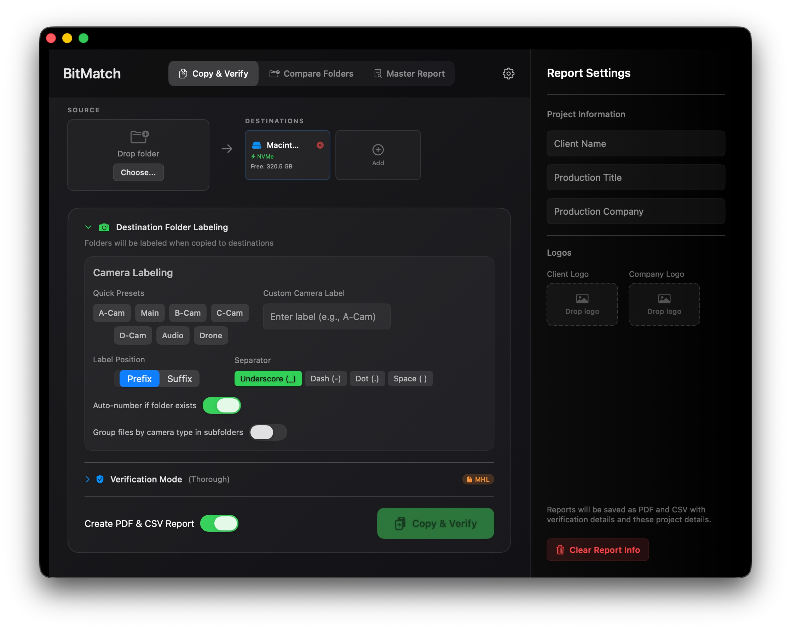

# BitMatch

A video file transfer and verification app for macOS and iPad. Copy camera cards to multiple backup drives, verify everything arrived intact, generate reports. The stuff you need on set.



## The Story

I was on a small film set and needed to offload camera cards. It was a friends grad film and Silverstack, ShotPut Pro, Hedge... they're all either expensive, subscription-based, or way overkill for what I needed. I just wanted to copy files to two drives and know they weren't corrupted. That's it. 

So I started building my own. It worked... it was simple. Then I kept working on it. Six months later, here we are. ~32,000 lines of Swift, runs on macOS and iPad/iPhone. The mobile version is actually useful. When you're run-and-gun shooting and don't have a laptop, you can still offload to a portable SSD from your phone.

## How It Works

```
📷 Camera Card
       │
       ▼
   BitMatch
    │    │
    ▼    ▼
  💾 A   💾 B
```

Plug in your card and your drives. BitMatch auto-detects which is which (drives ≥1TB are destinations, ≤512GB are sources). Hit copy. It writes to both backups simultaneously, verifies with checksums, and generates a report.

## Who This Is For

- YouTube creators
- People shooting shorts
- Small productions like web commericals/instagram ads whatever
- Anyone who doesn't want to pay $300/year for software that copies files

This is **not** for:
- Huge budget productions (use the enterprise tools, you can afford them)
- Union shoots (full DIT cart)

## Why This Is Safe

- 🚫 No cloud, no servers, no uploads
- 🔒 All verification happens locally on your machine
- ✅ Source and destination are never modified after copy
- 🔢 Checksums are industry-standard (SHA-256), not proprietary

## Why Open Source?

Honestly? Selling this seemed insane. Nobody's going to trust a "vibe coded" app from some random person with their irreplaceable footage. And I get it.

But if you download it, test it on some throwaway files, see that it works, and start using it? Great. That's the whole point.

## License (MIT, but read this)

It's MIT licensed, so legally you can do whatever you want with it.

I may also compile this and put it on the App Store at some point for the cost of a coffee, if I spend more time polishing the UI and distribution. The source will still be here either way.

But here's the spirit of it:

**Please do:**
- Download it, use it, love it
- Use it on every shoot you do
- Fork it, extend it, make it better
- Credit me if you build something from it

**Please don't:**
- Just slap it on the App Store unchanged and charge money for it

That last one... look, I can't legally stop you, but it's stupid and rude. If you're going to redistribute this commercially, actually *do something* with it. Add features. Make it better. Don't just be a lazy middleman.

## What It Does

### Copy & Verify
Copy files from a source (camera card, SSD, whatever) to multiple destinations simultaneously. Verify they copied correctly using checksums. Know your footage is safe.

### Verification Modes
- **Quick**: Just checks file sizes match (fast, good enough for most situations)
- **Standard**: SHA-256 checksums (the default, what you probably want)
- **Thorough**: Multiple checksum algorithms
- **Paranoid**: Byte-by-byte comparison + multiple checksums + MHL files (for when you really, really need to be sure or you wanna pretend youre gonna be on netflix)

### Camera Detection
Automatically recognizes cards from Sony, Canon, ARRI, RED, Blackmagic, Panasonic, Fujifilm, GoPro, DJI, Insta360, and generic DCIM structures. Names your backup folders based on the camera. Can autosort folders based on A/B/C camera sources. Some cameras work with this. I use Sonys. Sorry I didn't test them all. 

### Compare Folders
Already copied something manually? Compare two folders to see if they match.

### Reports
Generate PDF reports of what you transferred. Useful for producers who want documentation.

## Platform Support

- **macOS**: Full desktop app with drag-and-drop
- **iPad/iPhone**: Touch interface, works with external drives via Files app

The iPad version is the same core code, not a dumbed-down port. It just has a touch-friendly UI.

## Building It

### Requirements
- Xcode 15+
- macOS 14+

### To Build
1. Open `BitMatch.xcodeproj`
2. Select the `BitMatch` scheme for Mac or `BitMatch-iPad` for iOS
3. For iOS, you'll need to set your development team in Signing & Capabilities
4. Build and run

### iOS Notes
The iPad app uses iOS security-scoped URLs. You have to pick folders through the document picker you can't just hardcode paths. This is an iOS thing, not a limitation of the app. Annoying it won't just autoselect the drives and SD card like the mac app does but it is what it is.

## Technical Stuff

- ~32,000 lines of Swift
- SwiftUI for the interface
- Async/await for file operations
- About 80% of the code is shared between platforms
- No external dependencies (all native frameworks)

### Architecture
```
Shared/           # Core logic (works on both platforms)
├── Models/       # Data structures
└── Services/     # File operations, checksums, camera detection

Platforms/        # Platform-specific code
├── iOS/          # iPad/iPhone specific
└── macOS/        # Mac specific

BitMatch/         # macOS app
BitMatch-iPad/    # iOS app
```

## Contributing

Found a bug? Want to add a feature? PRs welcome.

Some things that would be cool:
- More camera detection patterns
- Better progress UI
- Network drive support improvements
- Localization

If you're going to contribute, build both the macOS and iPad schemes before submitting. The shared code means changes can break one platform without you noticing.

## Running Tests

```bash
xcodebuild test -scheme BitMatch -enableCodeCoverage YES
```

Or just run `bash test.sh` from the repo root.

## Known Issues

- There's a Swift 6 concurrency warning about actor isolation. It works fine, it's just the compiler being pedantic about future compatibility.
- iPad can't see some external drives until you explicitly grant access through the Files app first.

## Credits

Built by me over six months of "I'll just add one more feature" syndrome.

If you use this and it makes your live easier cool. If you improve it and share those improvements back, even cooler.

---

MIT License (b a good person) - see [LICENSE](LICENSE) for the legal text.
