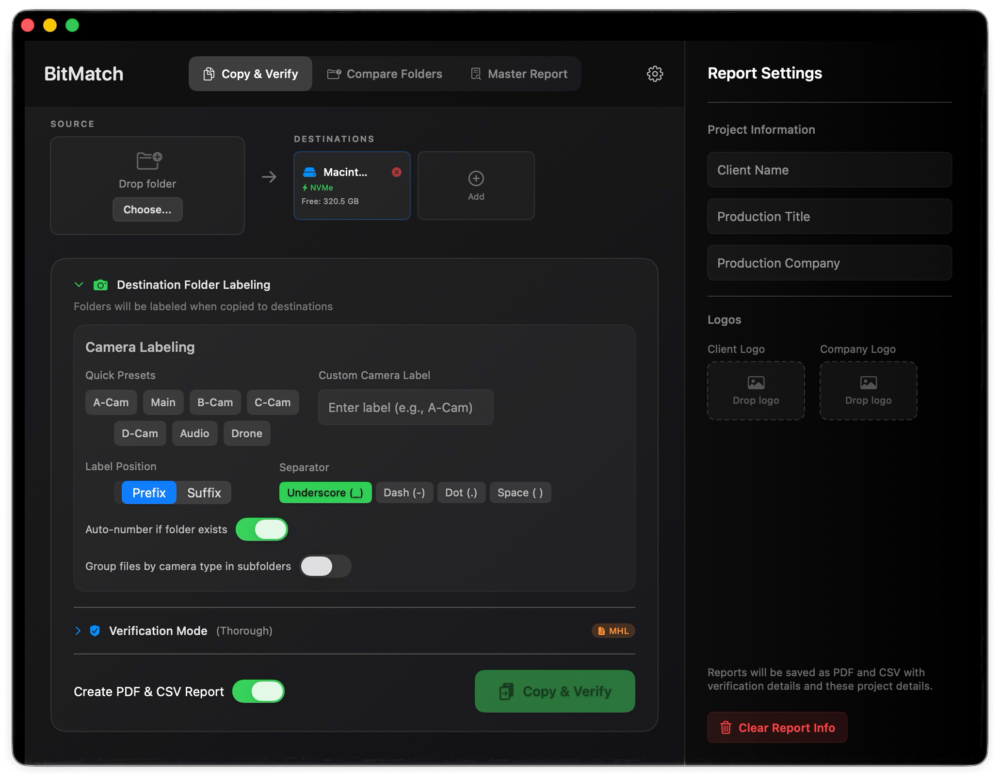
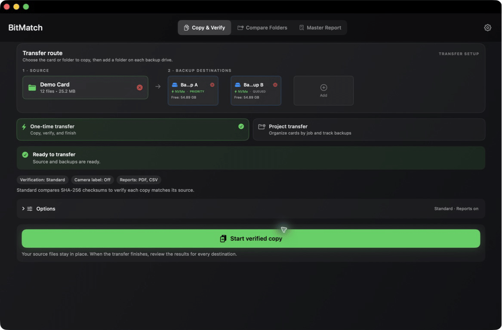

# BitMatch

**Verified camera-card backups for photographers and filmmakers.**

BitMatch is a free, open-source app for macOS and iPadOS. Copy photos and video to multiple drives, verify the copies with SHA-256, and keep a report of the results. Organize a whole shoot with photographer jobs, reusable folder recipes, and a record of each card.

[](https://github.com/mikecerisano/Bitmatch)
[](LICENSE)
[](https://github.com/mikecerisano/Bitmatch/releases)

[**Download for Mac**](https://github.com/mikecerisano/Bitmatch/releases) · [Release notes](CHANGELOG.md) · [Report a problem](https://github.com/mikecerisano/Bitmatch/issues)



*Current development build with synthetic local demo files. The downloadable release may look different.*

<details>
<summary>Watch the copy-and-verify demo</summary>



Real app screenshots: 12 sample files copied to two local folders, with all 24 copies independently checked against SHA-256 hashes. This animated screenshot sequence shows setup and completion; its timing is not measured transfer time. [Reproduce the demo](docs/demo/README.md).

</details>

## Get started

The [macOS release](https://github.com/mikecerisano/Bitmatch/releases) is Developer ID signed and Apple-notarized, with support for Apple Silicon and Intel Macs. Requires **macOS 15.5 or newer**. The iPad app requires **iPadOS 18.5 or newer** and is currently available by building from source.

1. Connect your camera card and backup drives.
2. Choose the source and destinations. For a shoot with several cards, create a project and choose its folder recipe.
3. Review the transfer plan: output folders, available space, verification mode, reports, and any blockers.
4. Start the transfer. **Standard SHA-256 verification is the default.**
5. Review the results for every destination and keep the report before clearing the source card.

## What you can do

- **Back up to multiple drives.** Copy a card or folder to several destinations and see each destination's results.
- **Organize a shoot.** Save jobs, photographers, cameras, and card identities. Reuse folder recipes while preserving the names and structure inside each card package.
- **Track verified local copies.** A card becomes locally safe only when the required number of exact local copies has verification evidence. Duplicate-card fingerprints provide warnings about previous ingests.
- **Keep sidecars with their media.** Reports include RAW/JPEG companion information, sidecars, warnings, and failed files.
- **Recognize camera structures.** Detection covers Sony, Canon, ARRI, RED, Blackmagic, Panasonic, Fujifilm, GoPro, DJI, Insta360, and generic DCIM layouts. Hardware coverage varies; see the beta guidance below.
- **Compare existing folders.** Check copies you already have with the folder comparison workflow.
- **Export evidence.** Generate PDF, CSV, and JSON reports, including photographer and card provenance. MHL generation is available in Thorough and Paranoid modes.
- **Add an off-site copy on Mac.** Send a verified local card package to an SFTP destination, with separate upload and remote-verification results.

## Verification modes

| Mode | Verification |
| --- | --- |
| Quick | Copy only; no checksum verification |
| Standard — default | SHA-256 |
| Thorough | SHA-256 and MD5 |
| Paranoid | Byte-by-byte comparison plus SHA-256 verification |

Quick mode does not prove that the source and destination contents match. Completion, local-copy safety, and remote verification are separate states in the app.

## Photographer jobs

Keep a wedding, event, or other shoot together across multiple photographers, cameras, and cards. Folder recipes organize the outer package; original media filenames and folders stay intact.

For example:

```text
2026-09-06_Smith-Wedding/
└── Originals/
    └── Mike/
        └── Sony-A7IV/
            └── Card-001/
                └── [original card contents]
```

The project dashboard records card ingests and local-copy evidence. Reports retain package paths, card fingerprints, companion counts, warnings, and the full results used to determine completion.

## Optional SFTP backup — macOS

Configure an SFTP destination for a project, then queue a backup from a verified local card package. Remote backup reads that local copy rather than the camera card.

- Authentication uses your SSH agent, with explicit host-key confirmation for a new host.
- The server needs SFTP and SSH shell access with standard file utilities, including hard-link support for publishing files without replacing existing ones. An SFTP-only account is insufficient.
- **SHA-256 read-back** downloads the remote file to check its contents, using additional bandwidth and local temporary space.
- **Upload only** is reported as **Uploaded · Unverified**.
- iPad can retain the project's remote destination settings; uploads run on Mac. S3 and WebDAV providers are not currently available.

Local copy, verification, and reporting work without a remote destination. BitMatch has no app analytics upload path; optional SFTP transfers send your selected backup data to the server you configure.

## Safety and beta status

BitMatch reads the source without writing to it. It copies through temporary files and does not overwrite conflicting destination files. Checksum modes reuse an existing file only after verifying that it matches.

Source scanning rejects unreadable metadata, unsafe paths, and portable filename collisions. Hidden files and empty folders are preserved, except for designated macOS metadata folders at the volume root; symlink entries are skipped. Verification rejects files that change size or identity while being read. Completion screens and reports include failures and sidecars in their verdicts.

**BitMatch is beta software.** Camera, filesystem, drive, hub, and OS coverage is still growing. Test with disposable files before using it on a job, keep source cards until all required destinations complete cleanly, and retain an independent copy of irreplaceable media.

Automated coverage includes source mutation, truncated reads, destination conflicts, cancellation, large manifests, and transfer faults. The [hardware testing procedure](docs/HARDWARE_TESTING.md) describes physical-media checks and fault/soak harnesses. See the [validation status](docs/HARDWARE_COMPATIBILITY.md) for recorded evidence, or submit a [hardware test report](https://github.com/mikecerisano/Bitmatch/issues/new?template=hardware-test.yml). Automated tests do not establish compatibility with every device.

See the [0.1.4 release notes](https://github.com/mikecerisano/Bitmatch/releases/tag/v0.1.4) for the latest release's fixes, build validation, and download checksum.

## Build from source

Use Xcode 16 or newer with SDKs that support the deployment targets above. CI uses Xcode 16.4.

1. Clone this repository and open `BitMatch.xcodeproj`.
2. Select `BitMatch` for Mac or `BitMatch-iPad` for iPad.
3. For an iPad device build, set your development team in Signing & Capabilities.
4. Build and run.

Run checks from the repository root:

```bash
bash test.sh mac-test       # macOS unit and integration tests
bash test.sh mac-build      # macOS Debug build
bash test.sh ipad-build     # iPad simulator Debug build
bash test.sh ipad-test      # requires IOS_SIMULATOR_DESTINATION
bash test.sh release-builds # macOS and iPad Release builds
```

CI runs `mac-test` and `ipad-build` on pushes and pull requests.

## Contribute

Bug reports, hardware test results, and pull requests are welcome. For a transfer problem, include your BitMatch and OS versions, source and destination filesystems, verification mode, connection setup, and steps to reproduce it. Remove private filenames and client information from any shared report.

Build both the Mac and iPad schemes when contributing code, since they share the transfer core. For physical-media tests, follow the [hardware testing procedure](docs/HARDWARE_TESTING.md).

## License

BitMatch is free and open source under the [MIT License](LICENSE).
