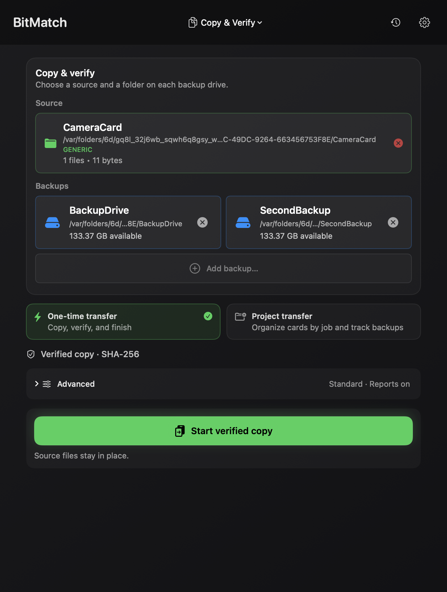
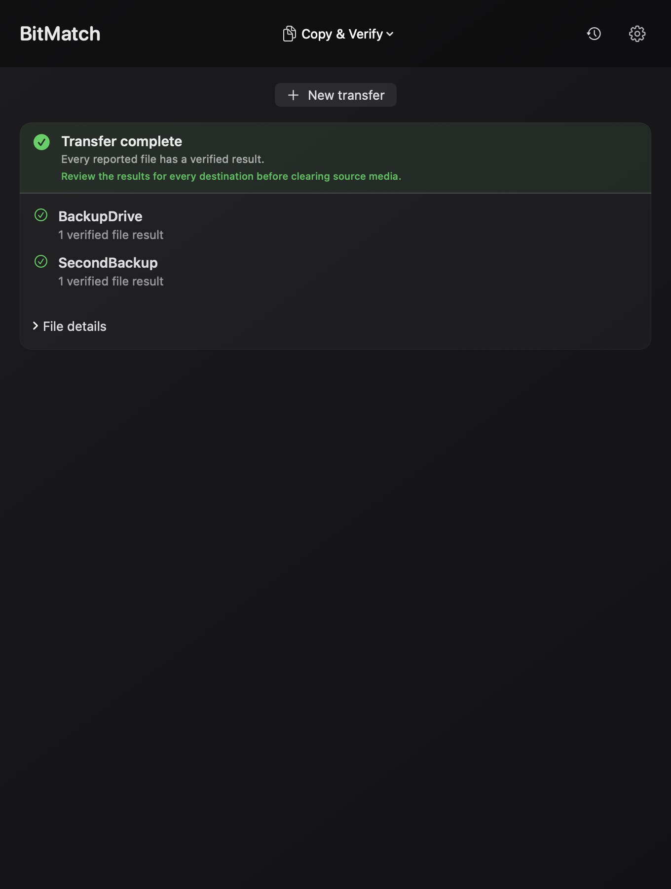
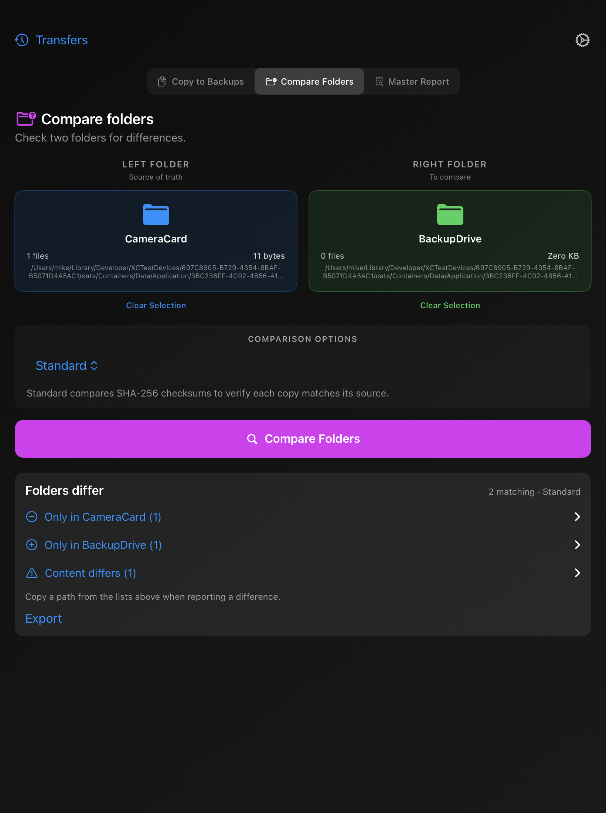
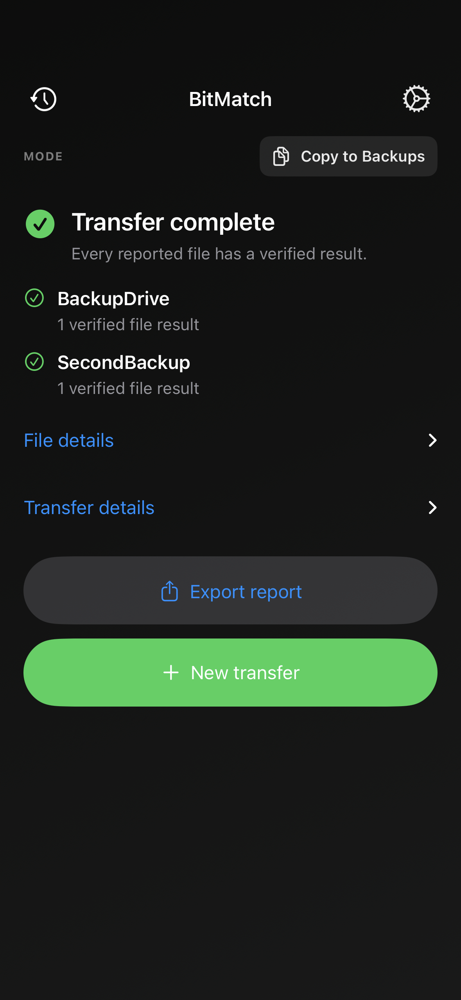

# BitMatch

**A free, open source alternative to ShotPut Pro, Silverstack, and Hedge.** Offload camera cards to multiple drives, verify the copies with SHA-256, generate reports. For indie filmmakers, YouTubers, photographers, and small productions that don't want a subscription just to copy files.

Now with photographer jobs, reusable folder recipes, and optional SFTP backups on Mac. Because apparently “I'll just add one more feature” wasn't a joke.

[](https://github.com/mikecerisano/Bitmatch)
[](LICENSE)
[](https://github.com/mikecerisano/Bitmatch/releases)

[**Download for Mac**](https://github.com/mikecerisano/Bitmatch/releases) · [Release notes](CHANGELOG.md) · [Report a problem](https://github.com/mikecerisano/Bitmatch/issues)



*The development build with sample data. These are layout previews, not real transfer results. The current Mac download is still v0.1.4; iPad and iPhone are build-from-source for now.*

<details>
<summary>More screenshots — Mac, iPad, and iPhone</summary>

**Mac: check each backup before clearing the card.**



**iPad: see what differs between two folders.**



**iPhone: the same per-backup results, on a smaller screen.**



[More screenshots and what we checked](docs/validation/2026-09-20/recovery-and-layout.md).

</details>

## Download

Signed and notarized macOS build on the [Releases page](https://github.com/mikecerisano/Bitmatch/releases). Supports Apple Silicon and Intel Macs.

Requires **macOS 15.5 or newer**. For iPad and iPhone, build from source for now; they require **iPadOS/iOS 18.5 or newer**.

## How It Works

```text
📷 Camera Card
       │
       ▼
   BitMatch
    │    │
    ▼    ▼
  💾 A   💾 B
```

Plug in your card and drives. Choose what you're copying and where the backups go. Check the transfer plan, hit copy, and let BitMatch verify the results. **Standard SHA-256 verification is the default.** Review every destination and keep the report before clearing the card.

One card to dump? Use **One-time transfer**. A whole shoot with several cards and cameras? Use **Project transfer**.

## What It Does

- **Multi destination copy** with SHA-256 verification. Each backup gets its own results.
- **Photographer jobs** for shoots with several photographers, cameras, and cards. Save the setup instead of rebuilding it every time.
- **Folder recipes** to organize the job without renaming or flattening the files on your card.
- **Card tracking** so you can see which cards have enough verified local copies. Duplicate-card warnings help catch the “did I already dump this one?” moment.
- **RAW/JPEG and sidecar reporting.** The little files count too. So do failures.
- **Camera detection** for Sony, Canon, ARRI, RED, Blackmagic, Panasonic, Fujifilm, GoPro, DJI, Insta360, and generic DCIM.
- **Folder compare** for stuff you already copied.
- **PDF, CSV, and JSON reports** for producers who want documentation, or you when you want to check what happened.
- **Transfer preflight on Mac, iPad, and iPhone** shows the source, backups, options, and anything that needs fixing before Start.
- **ASC MHL handoff records** after verified copies, with the details tucked under Advanced. This first version creates new inventories; it preserves existing histories and flags them for review. [Scope and validation](docs/validation/ascmhl/README.md).
- **Transfer queue and history** on Mac, iPad, and iPhone. Queue cards with their own settings, review interrupted attempts, retry, and export the results.
- **Optional SFTP backup on Mac** if you want an off-site copy after the local one is verified.

## Verification Modes

| Mode | What it checks |
| --- | --- |
| Quick | Copy only; no checksum verification |
| Standard — default | SHA-256 |
| Thorough | SHA-256 and MD5 |
| Paranoid | Byte-by-byte comparison plus SHA-256 verification |

Quick means copy only. It does **not** prove the contents match. A finished copy, a verified local backup, and a verified off-site backup are different things, and the app keeps them separate.

## Queue, Recovery, and Handoff

Open **Transfers** to queue another card or check what happened earlier. Each queued transfer keeps its own source, backups, and settings. The queue stops when something needs attention. A retry keeps the old attempt in history and checks the original folders before starting again; verified existing files can be reused after checking them.

On iPhone and iPad, keep BitMatch open while it works. iOS can interrupt a transfer; the saved attempt will be marked interrupted when you reopen the app. Project cards stay with their project and need review there before another ingest.

ASC MHL is on by default for verified copies. It adds another full read of each backup to create a compatible inventory. Existing ASC histories are left alone, with an issue shown instead of pretending they were extended. You can turn it off under **Advanced** when you don't need the handoff record. If a retry encounters an existing history, **Transfers → Details → Retry without ASC MHL** rechecks the copies without replacing that history. The one workflow BitMatch supports — verify locally, hand over an initial inventory, receiver validates — is written down in [SUPPORTED_WORKFLOW.md](docs/validation/ascmhl/SUPPORTED_WORKFLOW.md); there is no chain-of-custody claim.

These features are in the development source. The current download is still v0.1.4.

## Photographer Jobs

A wedding with two photographers, three cameras, and a pile of cards gets messy fast. Jobs keep it together. Pick a folder recipe, tell BitMatch whose card it is, and keep the original card contents intact.

For example:

```text
2026-09-06_Smith-Wedding/
└── Originals/
    └── Mike/
        └── Sony-A7IV/
            └── Card-001/
                └── [original card contents]
```

The dashboard keeps track of each card and its verified backups. Reports include where everything went, card fingerprints, RAW/JPEG companion counts, warnings, and failures. A card only becomes locally safe when the required number of exact local copies has been verified.

## Optional SFTP Backup — Mac

Have a server to back up to? Save an SFTP destination for the job and queue an upload once the local copy is verified. The upload reads that local backup, so it doesn't need to keep reading your camera card.

A few things to know:

- Authentication uses your SSH agent. You'll confirm the host key when connecting to a new host.
- The server needs SFTP **and SSH shell access**, with standard file utilities and hard-link support. An SFTP-only account won't do.
- **SHA-256 read-back** downloads the remote file to check it. That costs extra bandwidth and local temporary space.
- **Upload only** means **Uploaded · Unverified**. Getting it onto the server isn't proof that the contents match.
- iPad can keep the project's remote settings, but uploads run on Mac. S3 and WebDAV aren't available yet.

You can ignore SFTP entirely and keep everything local. No app analytics uploads. If you set up remote backup, your selected data goes to the server you chose.

## Before You Trust It With Your Footage

BitMatch reads the source without writing to it. It copies through temporary files and doesn't overwrite conflicting destination files. Checksum modes reuse an existing file only after verifying that it matches.

Source scanning rejects unreadable metadata, unsafe paths, and portable filename collisions. Hidden files and empty folders are preserved, except for designated macOS metadata folders at the volume root; symlink entries are skipped. Verification rejects files that change size or identity while being read. Completion screens and reports count failures and sidecars too.

**This is beta software from a one-person project.** I have not tested every camera, drive, filesystem, hub, or OS combination. Try it with disposable files before using it on a job. Keep the source card until every required backup finishes cleanly and you've checked the report. Keep another independent copy of anything you can't replace.

There are automated tests for changing source files, truncated reads, destination conflicts, cancellation, large manifests, and transfer faults. That doesn't mean every drive and hub has been tested. The [validation status](docs/HARDWARE_COMPATIBILITY.md) shows what we actually ran, including failures and things we couldn't test. If you want to help, follow the [hardware testing procedure](docs/HARDWARE_TESTING.md) and send a [hardware test report](https://github.com/mikecerisano/Bitmatch/issues/new?template=hardware-test.yml).

The [0.1.4 release notes](https://github.com/mikecerisano/Bitmatch/releases/tag/v0.1.4) have the latest release's fixes, build checks, and download checksum.

## Who It's For

YouTube creators, short film folks, wedding and event photographers, web commercials, Instagram ads, anyone who wants verified backups without another subscription.

Not for big budget shows or union shoots with a full DIT cart. Use the enterprise tools, you can afford them.

## Building

Xcode 16 or newer, with SDKs for the targets above. CI uses Xcode 16.4.

1. Clone this repository and open `BitMatch.xcodeproj`.
2. Pick `BitMatch` for Mac or `BitMatch-iPad` for iPad or iPhone.
3. For an iPad or iPhone device build, set your development team in Signing & Capabilities.
4. Build and run.

Tests, from the repository root:

```bash
bash test.sh mac-test       # macOS unit and integration tests
bash test.sh mac-build      # macOS Debug build
bash test.sh ipad-build     # iPad simulator Debug build
bash test.sh ipad-test      # requires IOS_SIMULATOR_DESTINATION
bash test.sh release-builds # macOS and iPad Release builds
```

The CI workflow is included, but GitHub Actions is currently disabled. Run `mac-test` and `ipad-build` locally before submitting changes.

## FAQ

**Will it work with my camera?** Probably. I personally shoot Sony, so that's the path I've beaten on. Detection for the other brands is in there, but that isn't the same as testing every camera. Open an issue if yours gives you trouble.

**Does it work on iPad and iPhone?** Both are core targets. They use the Files app for folder access. Build from source for now, and keep the app open during transfers; remote uploads are a Mac task.

**Why open source?** So you can trust it. The code is here. Read it before you trust your footage to it.

## Contributing

PRs welcome. Build both the Mac and iPad schemes before submitting. Shared code means changes can break one platform silently.

Found a transfer problem? Include your app and OS versions, drives and filesystems, verification mode, and what you did. Strip private filenames and client info from shared reports. Hardware test results are especially useful; here's [how to record them](docs/HARDWARE_TESTING.md).

## License (MIT, but read this)

MIT licensed, do what you want. The spirit:

**Please do** fork it, use it, improve it, credit me.

**Please don't** slap it on the App Store unchanged and charge for it. I can't legally stop you, but it's lazy. If you redistribute commercially, actually do something with it.

I might eventually put a compiled version on the App Store for the price of a coffee. Source stays here either way.

---

Built over six months of "I'll just add one more feature." MIT License, be a good person. See [LICENSE](LICENSE) for the legal text.
